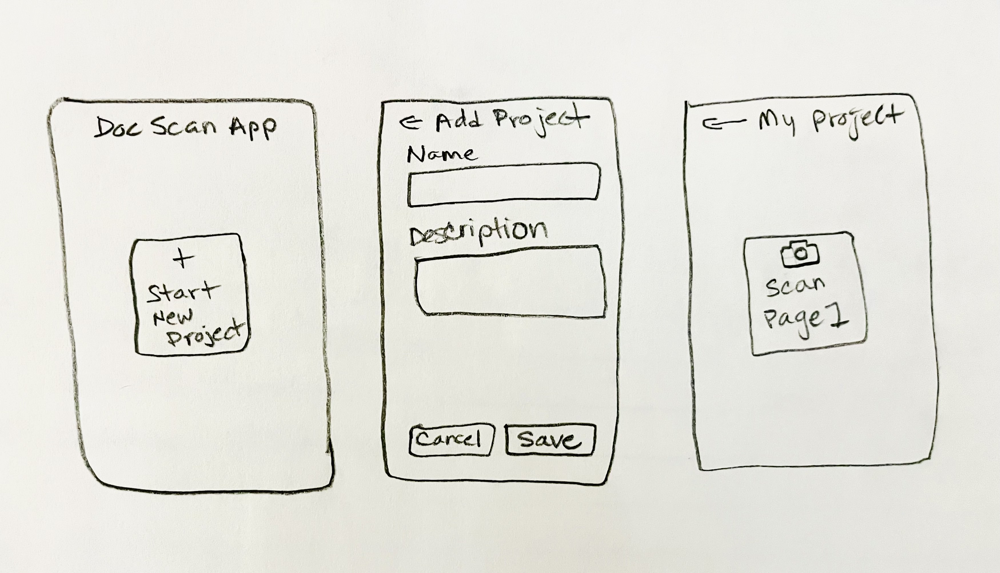
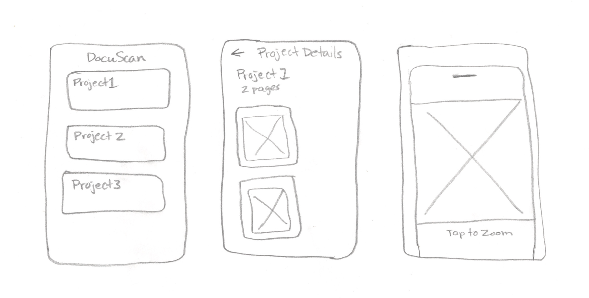
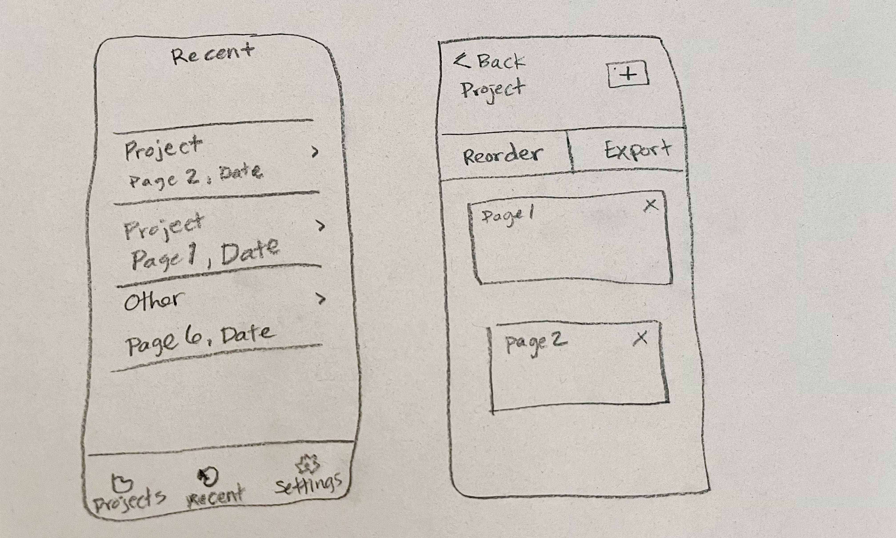

# Document Scanner App
A React Native mobile application built with Expo that allows users to create projects and capture pages of handwritten documents for digitization.

## Human Interface Guidelines Implementation

### Typography & Visual Elements
- **AddPageButton**: Uses 16pt vertical padding and 17pt fontSize for primary button text, following HIG button standards
- **ProjectCard**: Project names use 17pt fontSize with 400 weight, descriptions use 15pt, and page counts use 13pt, creating proper visual hierarchy
- **ProjectHeader**: Project titles use 24pt bold headers, descriptions use 16pt body text with 22pt line height
- **ConfirmationDialog**: Title uses 20pt fontWeight 600, message uses 16pt with 22pt line height, button text uses 16pt

### Modal Presentations & Navigation
- **Add/Edit Project Screens**: Use `presentation: 'modal'` in Stack.Screen options for proper iOS modal presentation
- **PhotoViewer**: Implements pinch-to-zoom (0.5x to 4x) and double-tap to toggle between 1x and 2x zoom levels, following iOS photo viewing conventions
- **ConfirmationDialog**: Matches iOS alert style with centered text, side-by-side buttons, and proper border styling with theme.divider

### System Integration & Theming
- **ThemeContext**: Automatically adapts to device's light/dark mode preferences using `useColorScheme()`, with manual toggle in Settings
- **Color Semantics**: Uses semantic color tokens - `theme.primary` (#5F6B52 light, #7A8B6B dark) for primary actions, `theme.error` (#C14A4A light, #D15A5A dark) for destructive actions, `theme.textSecondary` for secondary text
- **StatusBar**: Dynamically adjusts status bar style based on theme mode and system preference
- **TabBar**: Uses `tabBarActiveTintColor: theme.primary` and `tabBarInactiveTintColor: theme.textSecondary` for proper contrast

## Features

- **Project Management**: Create and organize document scanning projects
- **Tab Navigation**: Easy navigation between Projects, Recent, and Settings
- **Real Camera Capture**: High-quality document capture with framing guides and camera controls
- **Advanced Photo Viewing**: Pinch-to-zoom, double-tap zoom, and pan functionality
- **Theme Support**: Light and dark mode with proper contrast and accessibility
- **Orientation Control**: Locks screen to portrait mode during camera capture
- **Persistent Storage**: Projects and pages are saved locally using AsyncStorage
- **Haptic Feedback**: Tactile responses for important interactions
- **Professional UI**: Clean, modern interface following iOS Human Interface Guidelines

## NEW FEATURES

- **Image Rotation**: Rotate captured images to correct orientation for better document readability.
- **Swipe Actions**: Swipe left on projects to edit or delete them with intuitive gesture controls
- **Improved UI and User Flow**: Enhanced visual design and streamlined user experience throughout the app
- **Drag & Drop Page Reordering**: Long-press and drag pages to reorder them within projects for better document organization
- **Code Architecture**: Refactored with custom hooks for better performance and maintainability.

## Expo Packages Used

### Core Navigation & UI
- **expo-router** - File-based navigation system
- **@expo/vector-icons** - Icon library for UI elements
- **react-native-screens** - Native screen components for better performance

### Camera & Media
- **expo-camera** - Real camera functionality for document capture
- **expo-file-system** - File system access for photo storage
- **expo-image** - Optimized image component for better performance

### User Input & Interaction
- **expo-checkbox** - Checkbox component for settings
- **expo-haptics** - Tactile feedback for button interactions
- **react-native-gesture-handler** - Advanced gesture recognition for swipe actions
- **react-native-reanimated** - Hardware-accelerated animations

### Device Features
- **expo-screen-orientation** - Control screen rotation during scanning
- **expo-status-bar** - Status bar management

### Data Storage & Export
- **@react-native-async-storage/async-storage** - Local data persistence
- **expo-print** - PDF generation and printing capabilities
- **expo-sharing** - Share documents and files
- **react-native-html-to-pdf** - Convert content to PDF format

### UI & Theming
- **expo-blur** - Blur effects for modern UI design
- **expo-splash-screen** - Custom splash screen
- **react-native-safe-area-context** - Safe area handling for different devices

## Wire Frames

## Future Enhancements
- Image processing and text recognition (OCR)
- Cloud storage integration
- Project sharing capabilities
- Export options

## Development Notes

- Tested on Android emulator and iPhone 13
- Camera integration requires user permission for access
- Theme supports light and dark modes based on the user's device preference
- Data persists between app sessions via AsyncStorage (the Settings page includes
an option to "Clear All Data" which will clear the storage)
